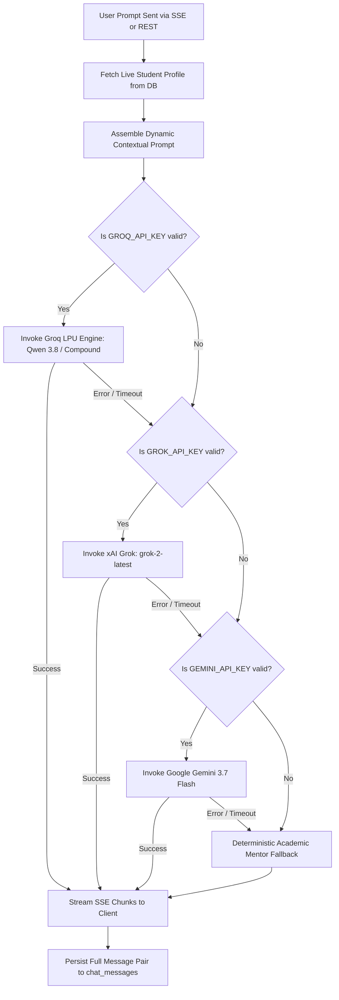

# Campus OS — System Architecture & Technical Specifications

This document outlines the architectural patterns, data flow, state management, and component hierarchy of **Campus OS**.

---

## 1. High-Level Architecture

Campus OS employs a hybrid single-page application (SPA) model powered by React 19 on the frontend and an Express TypeScript API layer on the backend, integrated with PostgreSQL / Supabase for persistence and a multi-provider LLM cascade for generative mentorship.

```
┌─────────────────────────────────────────────────────────────┐
│                       Client Browser                        │
│  React 19 SPA • Tailwind CSS v4 • Lucide Icons • Motion     │
└──────────────┬───────────────────────────────▲──────────────┘
               │ HTTP REST / JWT               │ SSE Event Stream
               ▼                               │
┌──────────────────────────────────────────────┴──────────────┐
│                  Express Application Server                 │
│                                                             │
│  ┌───────────────────────┐      ┌────────────────────────┐  │
│  │   Auth & RBAC Guards  │      │  Focus Pillars Engine  │  │
│  └───────────┬───────────┘      └───────────┬────────────┘  │
│              │                              │               │
│  ┌───────────▼───────────┐      ┌───────────▼────────────┐  │
│  │  Modular API Routers  │◄────►│ AI Mentor Orchestrator │  │
│  │  (Student/Admin/Opp)  │      │ (Groq / Grok / Gemini) │  │
│  └───────────┬───────────┘      └───────────┬────────────┘  │
└──────────────┼──────────────────────────────┼───────────────┘
               │ Connection Pool              │ API Key Auth
               ▼                              ▼
┌───────────────────────────────┐  ┌──────────────────────────┐
│  PostgreSQL / Supabase        │  │ External AI Providers    │
│  - 20 Relational Tables       │  │ - Groq LPU Cloud         │
│  - Foreign Keys & Indexes     │  │ - xAI Grok API           │
│  - Audit Logs & Sessions      │  │ - Google Gemini API      │
└───────────────────────────────┘  └──────────────────────────┘
```

---

## 2. Core Subsystems

### 2.1 Focus Pillars Engine (`server/services/focusPillarsEngine.ts`)
The Focus Pillars Engine is a proprietary recommendation system that dynamically maps a student's degree and career goal into 4 academic stages across 5 industry tracks:

1. **Track Detection**:
   - Analyzes target `careerGoal` and `degree` strings using keyword scoring.
   - Detects `ai`, `fullstack`, `cloud`, `cybersecurity`, `data`, or defaults to `general`.

2. **Stage Progression**:
   - **Stage 1 (Semesters 1–2)**: *Freshman Foundations & Tooling* — Core languages, Git/GitHub, foundational mathematics, terminal mastery.
   - **Stage 2 (Semesters 3–4)**: *Sophomore Core Systems & Algorithmic Design* — Data structures, algorithms, databases, API integration, software design patterns.
   - **Stage 3 (Semesters 5–6)**: *Junior Track Specialization & Internship Prep* — Production architectures, track-specific frameworks, open-source contributions, technical interview prep.
   - **Stage 4 (Semesters 7–8)**: *Senior Capstone / FYP & Industry Placement* — Final year project, system deployment, CI/CD, resume tailoring, full-time placement.

3. **Output Structure**:
   Each pillar contains:
   - Unique identifier and title (e.g., `01 - Neural Architecture & Deep Learning`)
   - Primary technology stack
   - Key competencies required
   - Recommended hands-on portfolio project
   - Suggested actionable milestone with priority and estimated completion time

---

### 2.2 AI Mentor Cascade ("Campus GPT")
The AI mentor engine provides real-time, context-aware coaching with resilient failover:



---

### 2.3 Career Readiness & Profile Completion Engine
Career readiness is computed via a multi-factor formula weighted across five dimensions:

$$\text{Readiness} = w_{\text{acad}} \cdot S_{\text{acad}} + w_{\text{skills}} \cdot S_{\text{skills}} + w_{\text{proj}} \cdot S_{\text{proj}} + w_{\text{exp}} \cdot S_{\text{exp}} + w_{\text{cert}} \cdot S_{\text{cert}}$$

- **Academic Standing ($S_{\text{acad}}$)**: GPA thresholding and degree progress completion percentage.
- **Skills Distribution ($S_{\text{skills}}$)**: Breadth across technical domains and verified proficiency levels (Expert/Advanced carry higher weights).
- **Verified Projects ($S_{\text{proj}}$)**: Repositories with live links, tech stack completeness, and completion status.
- **Experience ($S_{\text{exp}}$)**: Validated internships, university research assistantships, or external roles.
- **Certifications ($S_{\text{cert}}$)**: Industry-standard credentials and licenses.

---

## 3. Security Architecture & RBAC

1. **Authentication**:
   - Cryptographic salt generation with `bcryptjs` (minimum 10 rounds).
   - JWT tokens signed with HS256 algorithm and variable expiration.
   - Secure token storage in browser local storage or session headers.

2. **Authorization Middleware**:
   - `requireAuth`: Validates bearer tokens on all protected routes and injects `req.user`.
   - `optionalAuth`: Allows unauthenticated inspection while augmenting responses if a token is present.
   - `requireRole('admin')`: Restricts institutional management endpoints to validated administrators.

3. **Data Protection**:
   - Strict UUID validation prevents invalid parameter queries.
   - Parameterized SQL prevents SQL injection across all endpoints.
   - Row-level isolation ensures students can only modify their own resources.

---

## 4. Institutional Admin Engine

The administrative portal provides institutional faculty and career counselors with a 360-degree overview:
- **Top Metrics**: Aggregated across PostgreSQL with low-latency queries.
- **Student Risk Classifier**: Flags students based on configurable GPA alert thresholds (`admin_settings.gpa_threshold_alert`) and activity recency.
- **Automated AI Diagnostic**: Analyzes a student's missing prerequisites and generates structured guidance for academic advisors.
- **Universal Exporter**: Generates institutionally branded PDF print reports and raw Excel-compatible CSVs directly in the browser.
